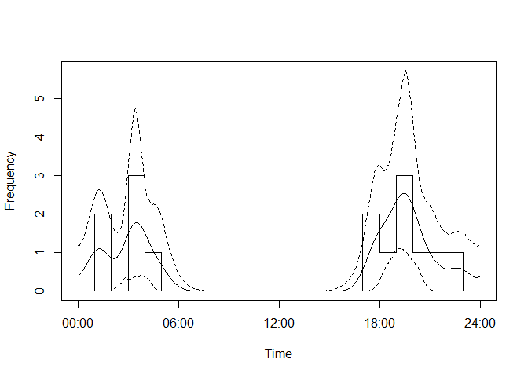
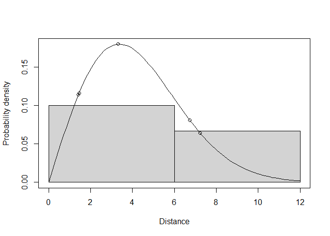
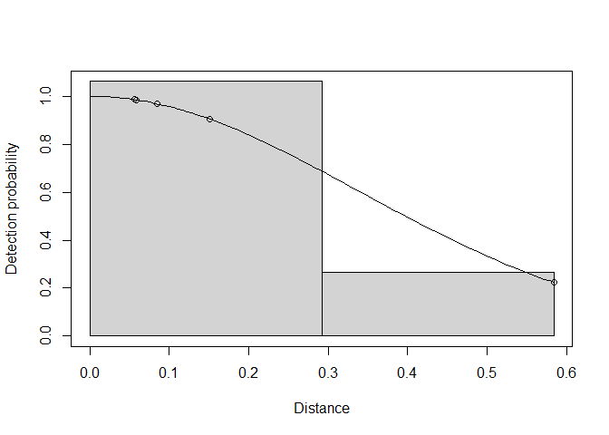

camtrapDensity
================

This is a development package designed to interface with and ultimately
merge with
[camtraptor](https://github.com/inbo/camtraptor/blob/main/README.md),
and to interface seamlessly with
[camtrapDP](https://tdwg.github.io/camtrap-dp/data/) datapackages
generated in [Agouti](https://www.agouti.eu). The package currently
provides functions to run single species random encounter models to
estimate animal density. There is also some basic functionality to check
and correct the data.

## Installation

You can install camtrapDensity from
[GitHub](https://github.com/MarcusRowcliffe/camtrapDensity), as well as
camtraptor, by running this code (you only need to do this for the
inital install or to update the packages; if the devtools package is not
already installed, run the first line to do so):

``` r
install.packages("devtools")
devtools::install_github("inbo/camtraptor")
devtools::install_github("MarcusRowcliffe/camtrapDensity")
```

## Example usage

Load the required packages at the beginning of each session:

``` r
library(camtraptor)
library(camtrapDensity)
```

Having annotated your images in Agouti (including marking animal
positions and deployment calibration poles), exported the data, unzipped
the resulting download and moved the contents to a directory named data
in your working project directory, run this to load the data:

``` r
pkg <- camtraptor::read_camtrap_dp("./data/datapackage.json")
```

    ## Please make sure you have the right to access data from this Data Package for your intended use.
    ## Follow applicable norms or requirements to credit the dataset and its authors.

    ## Three extra fields in `observations` interpreted as `speed`, `radius` and `angle`.

This provides a visualisation of the deployment schedules:

``` r
plot_deployment_schedule(pkg)
```

<!-- -->

This creates a subset datapackage excluding a named location (S01) and
including only deployments in October 2017:

``` r
subpkg <- subset_deployments(pkg,
                             locationName != "S01" &
                               start >= as.POSIXct("2017-10-01", tz="UTC") &
                               end <= as.POSIXct("2017-10-31", tz="UTC"))
```

This creates a datapackage corrected for a mis-specified time timestamp
at one deployment:

``` r
pkg_corrected <- correct_time(pkg,
                              deploymentID = "0d620d0e-5da8-42e6-bcf2-56c11fb3d08e",
                              wrongTime = "2017-01-01 00:00:00",
                              rightTime = "2017-01-01 12:00:00")
```

This allows you to inspect deployment calibration model diagnostic
plots, and derive a datapackage that records which deployments are
judged reliable, and whose position and speed data can therefore be used
in analyses:

``` r
pkg <- check_deployment_models(pkg)
```

## Estimating REM density

Density estimation can either be run as a single step, here without
specifiying species, in this case the function will present a table of
possible species and prompt you to choose which:

``` r
res <- rem_estimate(pkg, check_deployments=F)
```

Or one or more constituent models can be fitted separately, allowing
more flexibility in model choices, and passed to the rem_estimate
function; in this example all four models are fitted externally, based
on a pre-selected species, either with interactive choice:

``` r
sp <- select_species(pkg)
```

Or typed species name:

``` r
sp <- "Vulpes vulpes"
```

Then model fitting:

``` r
smod <- fit_speedmodel(pkg, species=sp)
pmod <- fit_actmodel(pkg, reps=100, species=sp)
rmod <- fit_detmodel(radius~1, pkg, order=0, species=sp)
amod <- fit_detmodel(angle~1, pkg, order=0, unit="radian", species=sp)
res <- rem_estimate(pkg, check_deployments=F, species=sp)
```

    ## Analysing Vulpes vulpes

## Understanding the output

The estimate result is a list with components:

- `estimates`: the density estimate and component parameters with their
  errors
- `species`: the species to which the estimates apply
- `data`: the trap rate data in the form of a table with counts and
  camera effort for each location
- `radius_model, angle_model, speed_model, activity_model`: the model
  objects from which estimates were derived. Access these list
  components like this:

``` r
res$estimates
```

    ##                  estimate          se        cv      lcl95      ucl95  n
    ## radius          4.7692252  1.10308342 0.2312920  2.6071817  6.9312687  5
    ## angle          44.4312270 11.28197392 0.2539199 22.3185581 66.5438959  5
    ## active_speed    3.0792649  0.76463024 0.2483158  1.5805896  4.5779401  4
    ## activity_level  0.2452761  0.06625227 0.2701130  0.1154217  0.3751305 15
    ## overall_speed  18.1264815  6.65075900 0.3669084  5.0909939 31.1619692 NA
    ## trap_rate       0.4419098  0.06224479 0.1408540  0.2986509  0.5167405  3
    ## density         5.7860938  4.11843199 0.7117811  1.6498041 20.2926401 NA
    ##                   unit
    ## radius               m
    ## angle           degree
    ## active_speed   km/hour
    ## activity_level    none
    ## overall_speed   km/day
    ## trap_rate        n/day
    ## density          n/km2

These are the core results. Rows `radius` and `angle` are the effective
detection radius and angle respectively. The `active_speed` row refers
to the estimated speed while active. `activity_level` is the estimated
proportion of time spent active. The `overall_speed` row refers to the
product of `active_speed` and `activity_level`, giving the overall
average speed, or day range. The `trap_rate` row is the number of animal
observations per unit time. `density` is the estimated number of animals
per unit area. Columns contain the estimates, their standard errors
(se), coefficients of variation (cv - se as a proportion of the
estimate), lower and upper 95% confidence intervals (lcl95 and ucl95),
sample sizes (n), and units. Sample size are the numbers of observations
available for estimation, except for trap rate, where n is the number of
locations.

Inspecting the trap rate data shows the number of observations available
at each location (n), the amounts of camera effort and its unit, and the
species to which this applies.

``` r
res$data
```

    ## # A tibble: 3 × 5
    ##   locationName     n effort effort_unit species      
    ##   <chr>        <int>  <dbl> <chr>       <chr>        
    ## 1 S01              3  10.0  day         Vulpes vulpes
    ## 2 S02              2   4.55 day         Vulpes vulpes
    ## 3 S03             10  19.4  day         Vulpes vulpes

Component models can be evaluated by inspecting plots.

``` r
plot(res$activity_model)
```

<!-- -->

``` r
plot(res$radius_model, pdf=TRUE)
```

<!-- -->

``` r
plot(res$angle_model)
```

<!-- -->
