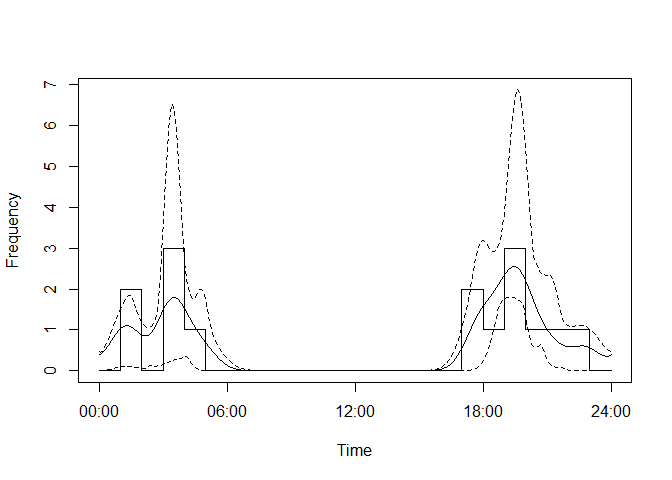

camtrapDensity
================

This is a development R package designed to interface, and ultimately
merge, with
[camtraptor](https://github.com/inbo/camtraptor/blob/main/README.md),
and to interface seamlessly with
[camtrapDP](https://tdwg.github.io/camtrap-dp/data/) datapackages
generated in [Agouti](https://www.agouti.eu). The package currently
provides functions to run single species random encounter models to
estimate animal density, including models for the component parameters
(speed, activity level and detection zone dimensions). There is also
some basic functionality to check and correct the data.

## <a id="GettingStarted"></a>Getting started with RStudio

If you don’t already have them, install [R](https://cran.r-project.org)
and [RStudio](https://posit.co/download/rstudio-desktop).

Run analyses within an RStudio project. To set up a new project in
RStudio in either a new or an existing project directory, use menu
options:

**File \> New Project \> New OR Existing Directory \> Browse \> select
directory \> Open \> Create Project**

This creates a file with extension .Rproj in the directory you chose or
created. By default, the last project you opened will re-open next time
you run RStudio. You can open a different project by double clicking the
relevant .Rproj file in your file browser, or by navigating to it from
the RStudio menu:

**File \> Open Project**

or

**File \> Recent Projects**

To start running analyses, open a new R script file:

**File \> New File \> R Script**

You can now add lines of code to the script window from the examples
below, edit them as necessary to fit your own case, and run them to
perform the analysis. To run code, move your cursor to the line you want
to run, or highlight multiple lines, and press **Ctrl+Enter** (Windows)
or **Cmd+Enter** (Mac), or click **Run** at the top of the code pane.

## Installing packages

Install `camtrapDensity`, `camptraptor` and the other necessary
supporting packages by running this code. You only need to run this code
once for the initial install, although it may be necessary to re-install
packages when important updates are released from time to time:

``` r
install.packages(c("devtools", "tidyverse"))
devtools::install_github("inbo/camtraptor")
devtools::install_github("MarcusRowcliffe/camtrapDensity")
```

## Example usage

Load the required packages at the beginning of each session (each time
you close and restart):

``` r
library(camtraptor)
library(camtrapDensity)
library(lubridate)
```

### Loading data

Having annotated your images in Agouti (including marking animal
positions and deployment calibration poles):

1.  download the data from Agouti;
2.  open R Studio and create a new project (see
    [above](#GettingStarted));
3.  unzip the Agouti download within your project directory.

This allows you to access multiple datapackages from a single project.
Alternatively you can create a new project for each datapackage by
reversing steps 2 and 3 above (unzip the data download first, then
create a new project in the resulting directory). To load data, use the
relevant platform- and case-specific code below (replacing the path
before `/datapackage.json` with your local directories):

``` r
# Data are in the project directory
pkg <- read_camtrapDP("datapackage.json")

# Data are in a subdirectory of the project directory
pkg <- read_camtrapDP("your_local_directory/datapackage.json")

# Data are outside the project directory (requires full path)
pkg <- read_camtrapDP("C:/path/to/your/folder/datapackage.json") # Windows
```

### <a id="ScheduleChecking"></a>Checking the deployment schedule

This line provides an interactive visualisation of the deployment
schedules. It can quickly highlight any incorrect dates, or help you
decide where to split the data if you only want to analyse a subset of
the deployments. Black lines indicate the period of operation of each
deployment and orange bars indicate the time at which each observation
occurred.

``` r
plot_deployment_schedule(pkg)
```

<div class="plotly html-widget html-fill-item" id="htmlwidget-a1c3906f45d574ff3410" style="width:672px;height:480px;"></div>
<script type="application/json" data-for="htmlwidget-a1c3906f45d574ff3410">{"x":{"data":[{"x":[3,3,3,3,3,3,3,3,3,3,3,3,2,2,2,2,1,1,1,1,4,4],"y":[1507804655,1507841809,1507856923,1508036890,1508183309,1508267880,1508269801,1508642068,1508642068,1508711345,1508733482,1508892657,1508821855,1509045090,1509045090,1509214658,1506967603,1506967603,1507007824,1507835504,1507806575,1508390591],"text":["deploymentID: 672fa539-f04c-4f82-b14b-cdeb5bef6f44<br />timestamp: 2017-10-12 10:37:35","deploymentID: 672fa539-f04c-4f82-b14b-cdeb5bef6f44<br />timestamp: 2017-10-12 20:56:49","deploymentID: 672fa539-f04c-4f82-b14b-cdeb5bef6f44<br />timestamp: 2017-10-13 01:08:43","deploymentID: 672fa539-f04c-4f82-b14b-cdeb5bef6f44<br />timestamp: 2017-10-15 03:08:10","deploymentID: 672fa539-f04c-4f82-b14b-cdeb5bef6f44<br />timestamp: 2017-10-16 19:48:29","deploymentID: 672fa539-f04c-4f82-b14b-cdeb5bef6f44<br />timestamp: 2017-10-17 19:18:00","deploymentID: 672fa539-f04c-4f82-b14b-cdeb5bef6f44<br />timestamp: 2017-10-17 19:50:01","deploymentID: 672fa539-f04c-4f82-b14b-cdeb5bef6f44<br />timestamp: 2017-10-22 03:14:28","deploymentID: 672fa539-f04c-4f82-b14b-cdeb5bef6f44<br />timestamp: 2017-10-22 03:14:28","deploymentID: 672fa539-f04c-4f82-b14b-cdeb5bef6f44<br />timestamp: 2017-10-22 22:29:05","deploymentID: 672fa539-f04c-4f82-b14b-cdeb5bef6f44<br />timestamp: 2017-10-23 04:38:02","deploymentID: 672fa539-f04c-4f82-b14b-cdeb5bef6f44<br />timestamp: 2017-10-25 00:50:57","deploymentID: c95a566f-e75e-4e7b-a905-0479c8770da3<br />timestamp: 2017-10-24 05:10:55","deploymentID: c95a566f-e75e-4e7b-a905-0479c8770da3<br />timestamp: 2017-10-26 19:11:30","deploymentID: c95a566f-e75e-4e7b-a905-0479c8770da3<br />timestamp: 2017-10-26 19:11:30","deploymentID: c95a566f-e75e-4e7b-a905-0479c8770da3<br />timestamp: 2017-10-28 18:17:38","deploymentID: d2f2e1f1-c8c5-4a04-9f58-4ac84f55843a<br />timestamp: 2017-10-02 18:06:43","deploymentID: d2f2e1f1-c8c5-4a04-9f58-4ac84f55843a<br />timestamp: 2017-10-02 18:06:43","deploymentID: d2f2e1f1-c8c5-4a04-9f58-4ac84f55843a<br />timestamp: 2017-10-03 05:17:04","deploymentID: d2f2e1f1-c8c5-4a04-9f58-4ac84f55843a<br />timestamp: 2017-10-12 19:11:44","deploymentID: d35f7b1b-ada3-4d15-b235-63452acd5a37<br />timestamp: 2017-10-12 11:09:35","deploymentID: d35f7b1b-ada3-4d15-b235-63452acd5a37<br />timestamp: 2017-10-19 05:23:11"],"type":"scatter","mode":"markers","marker":{"autocolorscale":false,"color":"rgba(238,154,73,1)","opacity":1,"size":5.6692913385826778,"symbol":"line-ew-open","line":{"width":1.8897637795275593,"color":"rgba(238,154,73,1)"}},"hoveron":"points","showlegend":false,"xaxis":"x","yaxis":"y","hoverinfo":"text","frame":null},{"x":[1,1,null,2,2,null,3,3,null,4,4],"y":[1506967603,1507835506,null,1508821855,1509214658,null,1507804655,1508892657,null,1507806575,1508390592],"text":["deploymentID: d2f2e1f1-c8c5-4a04-9f58-4ac84f55843a<br />start: 2017-10-02 18:06:43<br />deploymentID: 1<br />end: 1507835506","deploymentID: d2f2e1f1-c8c5-4a04-9f58-4ac84f55843a<br />start: 2017-10-02 18:06:43<br />deploymentID: 1<br />end: 1507835506",null,"deploymentID: c95a566f-e75e-4e7b-a905-0479c8770da3<br />start: 2017-10-24 05:10:55<br />deploymentID: 2<br />end: 1509214658","deploymentID: c95a566f-e75e-4e7b-a905-0479c8770da3<br />start: 2017-10-24 05:10:55<br />deploymentID: 2<br />end: 1509214658",null,"deploymentID: 672fa539-f04c-4f82-b14b-cdeb5bef6f44<br />start: 2017-10-12 10:37:35<br />deploymentID: 3<br />end: 1508892657","deploymentID: 672fa539-f04c-4f82-b14b-cdeb5bef6f44<br />start: 2017-10-12 10:37:35<br />deploymentID: 3<br />end: 1508892657",null,"deploymentID: d35f7b1b-ada3-4d15-b235-63452acd5a37<br />start: 2017-10-12 11:09:35<br />deploymentID: 4<br />end: 1508390592","deploymentID: d35f7b1b-ada3-4d15-b235-63452acd5a37<br />start: 2017-10-12 11:09:35<br />deploymentID: 4<br />end: 1508390592"],"type":"scatter","mode":"lines","line":{"width":1.8897637795275593,"color":"rgba(0,0,0,1)","dash":"solid"},"hoveron":"points","showlegend":false,"xaxis":"x","yaxis":"y","hoverinfo":"text","frame":null}],"layout":{"margin":{"t":26.228310502283104,"r":7.3059360730593621,"b":46.027397260273986,"l":69.406392694063939},"plot_bgcolor":"rgba(255,255,255,1)","paper_bgcolor":"rgba(255,255,255,1)","font":{"color":"rgba(0,0,0,1)","family":"","size":14.611872146118724},"xaxis":{"domain":[0,1],"automargin":true,"type":"linear","autorange":false,"range":[0.40000000000000002,4.5999999999999996],"tickmode":"array","ticktext":["S01","S02","S03","S03"],"tickvals":[1,2,3,4],"categoryorder":"array","categoryarray":["S01","S02","S03","S03"],"nticks":null,"ticks":"outside","tickcolor":"rgba(51,51,51,1)","ticklen":3.6529680365296811,"tickwidth":0.66417600664176002,"showticklabels":true,"tickfont":{"color":"rgba(77,77,77,1)","family":"","size":11.68949771689498},"tickangle":-90,"showline":true,"linecolor":"rgba(0,0,0,1)","linewidth":0.66417600664176002,"showgrid":false,"gridcolor":null,"gridwidth":0,"zeroline":false,"anchor":"y","title":{"text":"Location","font":{"color":"rgba(0,0,0,1)","family":"","size":14.611872146118724}},"hoverformat":".2f"},"yaxis":{"domain":[0,1],"automargin":true,"type":"linear","autorange":false,"range":[1506855250.25,1509327010.75],"tickmode":"array","ticktext":["2017/10/02","2017/10/09","2017/10/16","2017/10/23","2017/10/30"],"tickvals":[1506902400,1507507200,1508112000,1508716800,1509321600],"categoryorder":"array","categoryarray":["2017/10/02","2017/10/09","2017/10/16","2017/10/23","2017/10/30"],"nticks":null,"ticks":"outside","tickcolor":"rgba(51,51,51,1)","ticklen":3.6529680365296811,"tickwidth":0.66417600664176002,"showticklabels":true,"tickfont":{"color":"rgba(77,77,77,1)","family":"","size":11.68949771689498},"tickangle":-0,"showline":true,"linecolor":"rgba(0,0,0,1)","linewidth":0.66417600664176002,"showgrid":false,"gridcolor":null,"gridwidth":0,"zeroline":false,"anchor":"x","title":{"text":[],"font":{"color":"rgba(0,0,0,1)","family":"","size":14.611872146118724}},"hoverformat":".2f"},"shapes":[{"type":"rect","fillcolor":null,"line":{"color":null,"width":0,"linetype":[]},"yref":"paper","xref":"paper","x0":0,"x1":1,"y0":0,"y1":1}],"showlegend":false,"legend":{"bgcolor":"rgba(255,255,255,1)","bordercolor":"transparent","borderwidth":1.8897637795275593,"font":{"color":"rgba(0,0,0,1)","family":"","size":11.68949771689498}},"hovermode":"closest","barmode":"relative"},"config":{"doubleClick":"reset","modeBarButtonsToAdd":["hoverclosest","hovercompare"],"showSendToCloud":false},"source":"A","attrs":{"2f9421472a7a":{"x":{},"y":{},"type":"scatter"},"2f941a297d76":{"x":{},"y":{},"xend":{},"yend":{}}},"cur_data":"2f9421472a7a","visdat":{"2f9421472a7a":["function (y) ","x"],"2f941a297d76":["function (y) ","x"]},"highlight":{"on":"plotly_click","persistent":false,"dynamic":false,"selectize":false,"opacityDim":0.20000000000000001,"selected":{"opacity":1},"debounce":0},"shinyEvents":["plotly_hover","plotly_click","plotly_selected","plotly_relayout","plotly_brushed","plotly_brushing","plotly_clickannotation","plotly_doubleclick","plotly_deselect","plotly_afterplot","plotly_sunburstclick"],"base_url":"https://plot.ly"},"evals":[],"jsHooks":[]}</script>

### Mapping deployments

You can create a map of deployments using this code:

``` r
map_deployments(pkg)
```

<div class="leaflet html-widget html-fill-item" id="htmlwidget-ee64bf21fd565540fb4e" style="width:672px;height:480px;"></div>
<script type="application/json" data-for="htmlwidget-ee64bf21fd565540fb4e">{"x":{"options":{"crs":{"crsClass":"L.CRS.EPSG3857","code":null,"proj4def":null,"projectedBounds":null,"options":{}}},"calls":[{"method":"addTiles","args":["https://{s}.tile.openstreetmap.org/{z}/{x}/{y}.png",null,null,{"minZoom":0,"maxZoom":18,"tileSize":256,"subdomains":"abc","errorTileUrl":"","tms":false,"noWrap":false,"zoomOffset":0,"zoomReverse":false,"opacity":1,"zIndex":1,"detectRetina":false,"attribution":"&copy; <a href=\"https://openstreetmap.org/copyright/\">OpenStreetMap<\/a>,  <a href=\"https://opendatacommons.org/licenses/odbl/\">ODbL<\/a>"}]},{"method":"addCircleMarkers","args":[[51.53373644524688,51.53459069801548,51.53643262599534,51.53373644524688],[-0.1498603820800782,-0.1538944244384766,-0.1497745513916016,-0.1498603820800782],10,null,null,{"interactive":true,"className":"","stroke":true,"color":"#03F","weight":5,"opacity":0.5,"fill":true,"fillColor":"#03F","fillOpacity":0.2},null,null,["S03","S02","S01","S03"],null,null,{"interactive":false,"permanent":false,"direction":"auto","opacity":1,"offset":[0,0],"textsize":"10px","textOnly":false,"className":"","sticky":true},null]}],"limits":{"lat":[51.53373644524688,51.53643262599534],"lng":[-0.1538944244384766,-0.1497745513916016]}},"evals":[],"jsHooks":[]}</script>

You can plot the same map but with point diameter proportional to
deployment-specific trap rate for a given species like this (use
scientific names):

``` r
map_traprates(pkg, species="Vulpes vulpes")
```

<div class="leaflet html-widget html-fill-item" id="htmlwidget-e0d990824b86757e740d" style="width:672px;height:480px;"></div>
<script type="application/json" data-for="htmlwidget-e0d990824b86757e740d">{"x":{"options":{"crs":{"crsClass":"L.CRS.EPSG3857","code":null,"proj4def":null,"projectedBounds":null,"options":{}}},"calls":[{"method":"addTiles","args":["https://{s}.tile.openstreetmap.org/{z}/{x}/{y}.png",null,null,{"minZoom":0,"maxZoom":18,"tileSize":256,"subdomains":"abc","errorTileUrl":"","tms":false,"noWrap":false,"zoomOffset":0,"zoomReverse":false,"opacity":1,"zIndex":1,"detectRetina":false,"attribution":"&copy; <a href=\"https://openstreetmap.org/copyright/\">OpenStreetMap<\/a>,  <a href=\"https://opendatacommons.org/licenses/odbl/\">ODbL<\/a>"}]},{"method":"addCircleMarkers","args":[[51.53643262599534,51.53459069801548,51.53373644524688],[-0.1497745513916016,-0.1538944244384766,-0.1498603820800782],[15.71492943335834,21.72919402346724,25],null,null,{"interactive":true,"className":"","stroke":true,"color":["blue","blue","blue"],"weight":0,"opacity":0.5,"fill":true,"fillColor":["blue","blue","blue"],"fillOpacity":1},null,null,["S01: 29.9 (3 records)","S02: 44 (2 records)","S03: 51.7 (10 records)"],null,null,{"interactive":false,"permanent":false,"direction":"auto","opacity":1,"offset":[0,0],"textsize":"10px","textOnly":false,"className":"","sticky":true},null]},{"method":"addLegend","args":[{"colors":["red; width:6px; height:6px; border:0px solid red; border-radius:50%","blue; width:23.0298231481482px; height:23.0298231481482px; border:0px solid blue; border-radius:50%","blue; width:40.0596462962963px; height:40.0596462962963px; border:0px solid blue; border-radius:50%","blue; width:57.0894694444444px; height:57.0894694444444px; border:0px solid blue; border-radius:50%"],"labels":[0,20,40,60],"na_color":null,"na_label":"NA","opacity":1,"position":"topright","type":"unknown","title":"Records/100 days","extra":null,"layerId":null,"className":"info legend","group":null}]}],"limits":{"lat":[51.53373644524688,51.53643262599534],"lng":[-0.1538944244384766,-0.1497745513916016]}},"evals":[],"jsHooks":[]}</script>

### Subsetting deployments

Use this function if you want to analyse only a subset of deployments.
Commonly useful if your data contains multiple survey seasons and you
need to extract one of them for analysis, selecting deployments by date.
You can also select or exclude deployments or locations by name. Here
are some examples (note that these create a new data object called
`subpkg`):

``` r
# Keep only deployments starting after a given date
subpkg <- subset_deployments(pkg, start > ymd("2017-10-09"))
# Keep only deployments ending before a given date
subpkg <- subset_deployments(pkg, end < ymd("2017-10-23"))
# Keep only deployments occurring between given dates
subpkg <- subset_deployments(pkg,
                             start > ymd("2017-10-09") &
                               end < ymd("2017-10-23") )
# Keep only deployments at a given set of locations
subpkg <- subset_deployments(pkg, locationName %in% c("S01", "S02"))
# Keep all deployments except those at a given set of locations
subpkg <- subset_deployments(pkg, !locationName %in% c("S01", "S02"))
# Keep all deployments except those at a given location
subpkg <- subset_deployments(pkg, locationName != "S01")
```

After subsetting, check your sub-package to verify correct selection, as
[above](#ScheduleChecking).

### Time-slicing deployments

Use this function to take a time slice of the data. Observations outside
start and/or end times are discarded, and deployment start and/or end
times are rest to those times if they fall outside the slice.
Optionally, you can restrict the slicing to a subset of deployments,
selected on the basis of information in the deployments table. Here are
some examples:

``` r
# Slices all deployments to the interval between 9 Oct and 26 Oct mid-day
subpkg <- slice_camtrap_dp(pkg,
                           start = "2017/10/09 12:00:00",
                           end = "2017/10/26 12:00:00")
# Slices just the deployment at location S02 to finish on 27 Oct mid-day
subpkg <- slice_camtrap_dp(pkg,
                           end = "2017/10/27 12:00:00",
                           depChoice = locationName=="S02")
```

### Correcting timestamps

Sometimes a camera is deployed with date-time set incorrectly. In this
case you can correct all the times for this deployment by running the
following, with arguments identifying the datapackage (`pkg`), the
deployment to correct (`depID`), and reference times indicating the
amount by which the times are out (`wrongTime` and `rightTime`). The
next example represents a scenario where the camera spontaneously reset
to an arbitrary date-time at the start of a deployment, but it is known
when this reset happened (for example `rightTime` taken from the correct
time on the image of an info board at set up, and `wrongTime` taken from
the info strip added by the camera to this image):

``` r
pkg_corrected <- correct_time(pkg,
                              depID = "c95a566f-e75e-4e7b-a905-0479c8770da3",
                              wrongTime = "1970-01-01 00:05:00",
                              rightTime = "2023-10-10 14:23:00")
```

To find the long deployment ID, you can view the deployment data table
and copy the relevant value from the deploymentID column:

``` r
View(pkg$data$deployments)
```

Alternatively, you can change date-times by location name (remembering
that a location can include more than one deployment). Also, if you know
the time offset required and don’t need to take it from a reference
image on a particular date, (for example, you know that when setting the
camera the wrong time zone was used, or there was an AM/PM mix up), you
can supply times with the desired time offset but an arbitrary
date-time. For example, this adds 12 hours to all the timestamps from
location S01:

``` r
pkg_corrected <- correct_time(pkg,
                              locName = "S01",
                              wrongTime = "2000-01-01 00:00:00",
                              rightTime = "2000-01-01 12:00:00")
```

Both examples create a new datapackage object called `pkg_corrected`.

### <a id="CalibrationChecking"></a>Checking deployment calibration models

Run the next chunk to show diagnostic plots for the deployment
calibration models used to generate animal position and speed data
(replacing `pkg` with the name of a subsetted and/or time-corrected
package if necessary). Then follow the interactive instructions to
accept or reject each calibration model. See the document “*Interpreting
deployment model diagnostic plots*” for guidance on how to decide,
available [here](http://www.tinyurl.com/CalibrationPlots).

``` r
pkg_chk <- check_deployment_models(pkg)
```

The datapackage called `pkg_chk` will now keep a record of which
deployments have been rejected, and position and speed data from these
deployments will be excluded from subsequent analysis, since we expect
them to be unreliable.

### Estimating REM density

Density estimation can be run as a single step, most simply like this:

``` r
res <- rem_estimate(pkg)
```

This will prompt you to choose which species to analyse, and run
deployment calibration model checks as [above](#CalibrationChecking).
The next line of code is an alternative example that runs the analysis
on a datapackage that has already had its deployment calibration models
checked (`pkg_chk`) and switches off calibration model checking
(`check_deployments=FALSE`), avoiding having to do this each time you
analyse a different species; it also specifies a species
(`species = "Vulpes vulpes"`), rather than using interactive selection;
and it reduces the number of replications used to generate standard
errors (`reps = 10` - this can be useful to speed things up for
exploration, but should be left out when generating final results):

``` r
res_vul <- rem_estimate(pkg_chk,
                        check_deployments = FALSE,
                        species = "Vulpes vulpes",
                        reps = 10)
```

Alternatively, one or more REM component models can be fitted separately
before the density estimation step, allowing more flexibility in model
choices. In this example all four models (detection radius, detection
angle, speed while active and activity level) are fitted first, with
species pre-defined. Species can be chosen either interactively:

``` r
sp <- select_species(pkg_chk)
```

or specified directly:

``` r
sp <- "Vulpes vulpes"
```

Then model fitting might look like this:

``` r
smod <- fit_speedmodel(pkg_chk, species=sp)
pmod <- fit_actmodel(pkg_chk, reps=100, species=sp)
rmod <- fit_detmodel(radius~1, pkg_chk, order=0, species=sp, truncation=6)
amod <- fit_detmodel(angle~1, pkg_chk, order=0, unit="radian", species=sp)
res_vul <- rem_estimate(pkg_chk, check_deployments=F, species=sp,
                        radius_model = rmod,
                        angle_model = amod,
                        speed_model = smod,
                        activity_model = pmod)
```

### Understanding the output

The output of `rem_estimate` is a list with components:

- `estimates`: the density estimate and component parameters with their
  errors
- `species`: the species to which the estimates apply
- `data`: the trap rate data in the form of a table with counts and
  camera effort for each location
- `radius_model`, `angle_model`, `speed_model`, `activity_model`: the
  model objects from which parameter estimates were derived.

You can inspect these list components individually by attaching the
compenent name to the result object spearated with a \$ sign, like this:

``` r
res_vul$estimates
```

    ##                  estimate         se         cv       lcl95      ucl95  n
    ## radius          4.6552400 0.35422329 0.07609131  3.96096233  5.3495176 14
    ## angle          44.9831275 9.42829597 0.20959628 26.50366740 63.4625876 15
    ## active_speed    1.3414083 0.60283473 0.44940435  0.15985224  2.5229644  6
    ## activity_level  0.2451959 0.07650352 0.31200980  0.09524899  0.3951428 15
    ## overall_speed   7.8937874 4.31866204 0.54709632 -0.57079022 16.3583650 NA
    ## trap_rate       0.4124492 0.05263407 0.12761348  0.34138308  0.4712926  3
    ## density        12.6605171 7.21627687 0.56998279  4.47688294 35.8036376 NA
    ##                   unit
    ## radius               m
    ## angle           degree
    ## active_speed   km/hour
    ## activity_level    none
    ## overall_speed   km/day
    ## trap_rate        n/day
    ## density          n/km2

This table provides the core results. Rows `radius` and `angle` are the
effective detection radius and angle respectively. The `active_speed`
row refers to the estimated speed while active. `activity_level` is the
estimated proportion of time spent active. The `overall_speed` row
refers to the product of `active_speed` and `activity_level`, giving the
overall average speed, or day range. The `trap_rate` row is the number
of animal observations per unit time. `density` is the estimated number
of animals per unit area. Columns contain the estimates, their standard
errors (se), coefficients of variation (cv - se as a proportion of the
estimate), lower and upper 95% confidence intervals (lcl95 and ucl95),
sample sizes (n), and units. Sample size are the numbers of observations
available for estimation, except for trap rate, where n is the number of
locations.

Inspecting the trap rate data shows the number of observations available
at each location (n), the amounts of camera effort and its unit, and the
species to which this applies:

``` r
res_vul$data
```

    ## # A tibble: 3 × 7
    ##   locationName latitude longitude     n effort effort_unit scientificName
    ##   <chr>           <dbl>     <dbl> <int>  <dbl> <chr>       <chr>         
    ## 1 S01              51.5    -0.150     3  10.0  day         Vulpes vulpes 
    ## 2 S02              51.5    -0.154     2   4.55 day         Vulpes vulpes 
    ## 3 S03              51.5    -0.150    10  19.4  day         Vulpes vulpes

To save a results table to an external file, run this (a file named as
indicated will be created in your project directory):

``` r
write.csv(res_vul$estimates, "vulpes_REM_results.csv")
```

You can also use this convenience function to save results with
additional information about the species and project, including the
option to save a single data table of results for multiple species:

``` r
write_rem_csv(res_vul, res_cer, res_cap)
```

Here, three objects are provided separated by commas, but it could be
any number. Each should be an object created as output from a call to
`rem_estimate`.

Component model fits can be evaluated by inspecting diagnostic plots:

``` r
plot(res_vul$activity_model)
```

<!-- -->

``` r
plot(res_vul$radius_model, pdf=TRUE)
```

<!-- -->

``` r
plot(res_vul$angle_model)
```

<!-- -->

## General R tips

Once you have fitted one or more REM models in a session, you may want
to save your progress so that you don’t have to run again everything
next session. To do this, save your workspace image when you exit
RStudio. By default, RStudio should prompt you to do this on exit, and
automatically reload your work next time you open the project. However,
you can save your workspace manually, either using the RStudio menu:

**Session \> Save Workspace As \> provide a file name \> Save**

or by running one of these lines:

``` r
save.image() # Creates a file named .RData in the project directory
save.image("12Feb24.RData") # Creates a file named 12Feb24.RData
```

At the start of the next session, if you want to load a specific
workspace, you can either use the menu:

**Session \> Load Workspace \> select the required RData file \> Open**

or run this line, replacing the text with your file name:

``` r
load("12Feb24.RData")
```

To get help on any function, including details on all the argument
options, run the function name preceded by a question mark, e.g.

``` r
?rem_estimate
```
